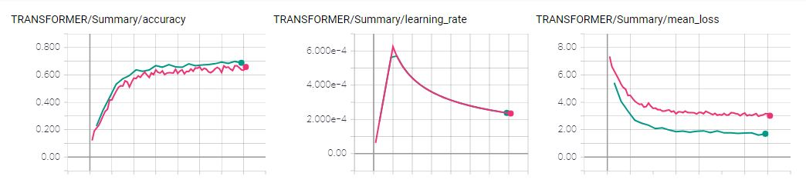
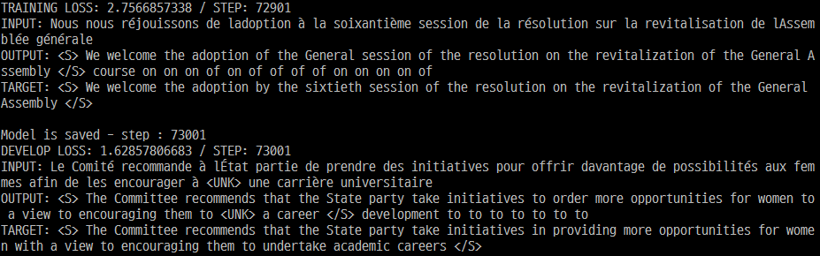
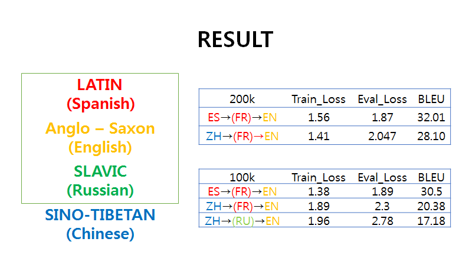
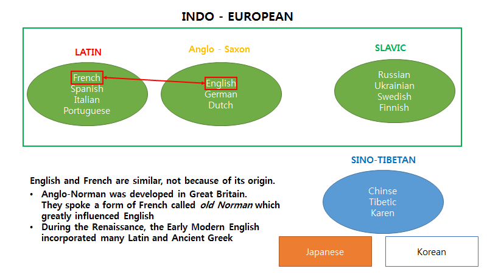

# Zero-Shot translation ( tensorflow / Transformer )

## Translation / Zero-Shot Translation implemented by Transformer
 * Google has released a zero-shot translation task through the GNMT model. The project will try to use the new model(Transformer) to perform translation tasks and experiment with the possibility of translating zero-shot through various languages.
 * First, You can train your translation model ( Transformer ) using `vanilla_transformer`
 * Second, You can have experiment of Zero-Shot translation using Transformer by `transformer_zero_shot`
 * Figure below this paragraph shows the concept of Zero-Shot translation

## Requirements
  
## File description
  * `preprocessor.py` download & preprocess data ( you can use OpenSubtitle2018 / MultiUN dataset )
  * `data_loader.py` define class for data load ( Input pipeline developed by tf.dataset)
  * `model_layer.py` define all layer needed for construct transformer model
  * `model.py` define transformer model    
  * `train.py` for training model
  * `eval.py` is for evaluation

## Training & Evaluation Process 
* STEP 1. Set the configuration by editing `hyperparams.py` 
* STEP 2. Run `preprocessor.py` , it will preprocess and make training data 
* STEP 3. Run `train.py` to train your model
* STEP 4. Run `eval.py` to save result and calculate BLEU score

## Vanilla translation

### Training process
  
  
  
  
## Zero-Shot translation

### Result 

### Discussion

## Reference 
  * Ashish Vaswan, Noam Shazeer, Niki Parmar, Jakob Uszkoreit, Llion Jones, Aidan N. Gomez, Łukasz Kaiser Illia Polosukhin  Attention Is All You Need, arXiv:1706.03762v5, 2017
  * Melvin Johnson, Mike Schuster, Quoc V. Le, Maxim Krikun, Yonghui Wu, Zhifeng Chen, Nikhil Thorat , Fernanda Viégas, Martin Wattenberg, Greg Corrado, Macduff Hughes, Jeffrey Dean, Google’s Multilingual Neural Machine Translation System: Enabling Zero-Shot Translation, arXiv:1611.04558v2 2017  
  * Jörg Tiedemann, 2012, Parallel Data, Tools and Interfaces in OPUS. In Proceedings of the 8th International Conference on Language Resources and Evaluation (LREC 2012)
  * P. Lison and J. Tiedemann, 2016, OpenSubtitles2016: Extracting Large Parallel Corpora from Movie and TV Subtitles. In Proceedings of the 10th International Conference on Language Resources and Evaluation (LREC 2016)
  * https://github.com/Kyubyong/transformer
  
